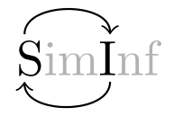

> A flexible and efficient framework for data-driven stochastic disease spread simulations

[](https://travis-ci.org/stewid/SimInf)
[](https://ci.appveyor.com/project/stewid/SimInf)
[](https://CRAN.R-project.org/package=SimInf)
[](https://CRAN.R-project.org/package=SimInf)
[](https://coveralls.io/github/stewid/SimInf?branch=master)

# SimInf

The package provides an efficient and very flexible framework to
conduct data-driven epidemiological modeling in realistic large scale
disease spread simulations. The framework integrates infection
dynamics in subpopulations as continuous-time Markov chains using the
Gillespie stochastic simulation algorithm and incorporates available
data such as births, deaths and movements as scheduled events at
predefined time-points. Using C code for the numerical solvers and
'OpenMP' (if available) to divide work over multiple processors
ensures high performance when simulating a sample outcome. One of our
design goals was to make the package extendable and enable usage of
the numerical solvers from other R extension packages in order to
facilitate complex epidemiological research. The package contains
template models and can be extended with user-defined models.

## Installation

You can install the released version of `SimInf` from
[CRAN](https://CRAN.R-project.org/package=SimInf)


```r
install.packages("SimInf")
```

or use the `remotes` package to install the development version from
[GitHub](https://github.com/stewid/SimInf)


```r
library(remotes)
install_github("stewid/SimInf")
```

We refer to section 3.1 in the
[vignette](https://CRAN.R-project.org/web/packages/SimInf/vignettes/SimInf.pdf)
for detailed installation instructions.

# Authors

Pavol Bauer [](https://orcid.org/0000-0003-4328-7171),
Robin Eriksson [](https://orcid.org/0000-0002-4291-712X),
Stefan Engblom [](https://orcid.org/0000-0002-3614-1732),
and Stefan Widgren [](https://orcid.org/0000-0001-5745-2284)
**(Maintainer)**

Any suggestions, bug reports, forks and pull requests are
appreciated. Get in touch.

# Acknowledgments

This work was financially supported by the Swedish Research Council
within the UPMARC Linnaeus centre of Excellence (Pavol Bauer, Robin
Eriksson and Stefan Engblom), the Swedish Research Council Formas
(Stefan Engblom and Stefan Widgren), the Swedish Board of Agriculture
(Stefan Widgren), and by the Swedish strategic research program
eSSENCE (Stefan Widgren).

# License

The `SimInf` package is licensed under the
[GPLv3](https://github.com/stewid/SimInf/blob/master/LICENSE).
